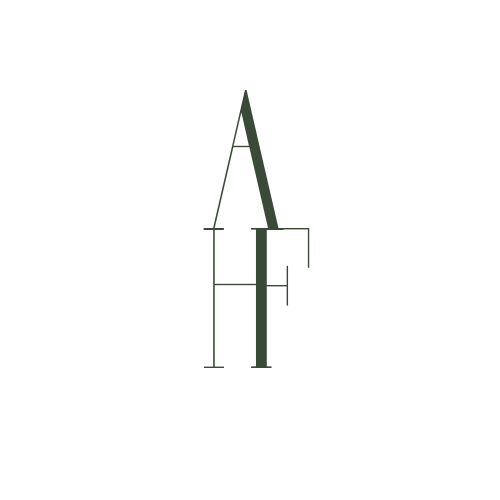

# Praktisk Informasjon

## Program for dagen

**14:00 :wedding:** Vielsen

**15:45 :champagne:** Velkomstdrink og mingling på Roterud gård.

**16:30 :cake:** Bryllupskake og felles fotografering.

**18:00 :fork_and_knife:** Middag.

*\* Med unntak av vielsen er tidspunktene omtrentlige og kan bli justert etter behov.* 

## Dresskode

Mørk dress / smoking

## Transport
Vi skal sette opp fellestransport til vielse og fest. Dette blir et gratistilbud for de som ønsker å benytte seg av dette.

- **Kl 13:15**: Transport i fra Wood Hotel til Ringsaker kirke. Oppmøte vil være utenfor hovedinngangen.
- **Etter vielsen**: Transport i fra kirken til festen på Roterud

Utover dette må transport organiseres på eget initiativ. 

**For hjemreisen:** det anbefales å gå sammen om å booke taxi på vei hjem i fra festen. 

Aktuell kontaktinformasjon:

- **Moelv Taxi:** 62 36 72 79
- **Nes Taxi:** 959 50 125
- **Brumunddal Taxi:** 62 34 11 22

## Taler 

Dersom dere ønsker å si noen ord under bryllupsmiddagen kan dere kontakte en av våre toastmastere **Ole Fredrik Bratberg** (tlf 412 67 341) eller **Johannes Groseth** (tlf 482 61 922)
innen 1. juni.

Det er mikrofon, projektor og høyttalere med nødvendige tilkoblingskabler til PC tilgjengelig på lokalet.

## Overnattingsmuligheter
Se [Overnatting og kart](Overnatting.md)

## Annet

Øvrige spørsmål kan rettes til Annicken :woman_office_worker:	på tlf 454 45 668 eller på e-post [anbruu@gmail.com](mailto:anbruu@gmail.com)

{: style="height:150px;width:150px"}
